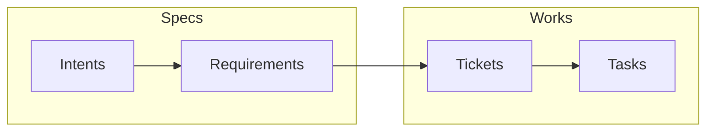

# ActionBridge

## Overview

The most reliable way to build software using AI coding agents is to request work in small, incremental steps executed within a highly scoped context, covered by extensive unit-tests. Prompts must be highly descriptive and precise, yet completely devoid of irrelevant noise. 

Any large codebase is typically divided into multiple projects, each featuring a deep directory hierarchy housing the source code. An agent working in the _data access layer_ does not need the same rules or documentation as an agent working on the _user interface_. However, all agents working on _unit testing_ might share a common baseline of rules while specific guidelines depending on what is being tested must be defined. Even the toolsets, Model Context Protocols (MCPs), and Skills will vary by work-item.

The core concept of `ActionBridge` is to store agent definitions, toolling, contextual information like rules, guidelines and requirements in specific folders within this hierarchy, directly alongside the source code they pertain to. It introduces a structured, file-system-based workflow built on the principle of **Hierarchical Aggregated Context Preprocessor**. This principle aggressively optimizes AI agent execution by maximizing the signal-to-noise ratio, delivering superior results within complex codebases.

## Quick Start

### 1. Plug-In

You have to install the `BridgeMarker` plug-in :
- VS-Code : ...
- Visual Studio : ...

### 2. Start Dashboard

Download the `ActionBridge.Manager` application, an start it. Connect to the right local port with a Browser, or use the `ActionBridge.Dashboard` application.

### 3. Reference a root project directory

Click `"Add Project..."` and enter the local, absolute path to the root directory of your source code. Configure at least one the LLM end point.

In the root project directory is created a `.bridge` directory.

### 4. Choose Workflow

If `ActionBridge` have never been used on this project, you have to choose a predefined Workflow Configuration.

### 5. First Marker

Open a source file in the project, select few code text, and call the Marker plug-ins by choosing "Create Marker" in local contextual "right click" menu. Come back in the Dashboard. You can see the Marker. You can create multiple markers.

### 6. Start a Task

Check a Marker. You can create a simple `Task`, then click "Run". The entered prompt is then pushed to a fresh new 

# Principles

## Components

The ActionBridge tooling is composed of few components :

- **The Marker Tool** : it is a Visual Studio or VS Code plug-in to create a context file from which starting a new operation.
- **The Dashboard:** On top is a UI tool that allows users to configure, visualize, and manage the entire workflow.
- **The Bridge:** In between is the `bridge.exe` CLI application, which manages the workflow files and orchestrates the state machine.

In the `.bridge` directory created at the root of the project directory, is a `/bin` directory containing the `bridge.exe` CLI application. To manage the Agentic workflow, an instance of `bridge.exe --listen` must be started.

## Features

The `bridge.exe` is a reactive application that read the configuration files and listen to file changes in the entire project directory tree. An empty, default installation cannot run any task. A minimal configuration is needed. `bridge.exe` only provide this features :
- Applying the configured workflow by starting the right agent with the right item file.
- Building the prompts with macro processing.
- Generate the new files for LLMs (using tool), with the specified naming format.
- Manage the unique identifier creation to avoid conflits.
- Perform clean-up when needed (deleting files).
### The Minimal Workflow Configuration

The default configuration is a minimalist workflow that execute `Tasks` using only a single `Agent` definition. To do so, `Spaces` must be defined.

A `Space` is a sub directory in the `.bridge` directory. Those `Spaces` are defined in `.bridge/_map.json`. This file contains directories definitions :

| Space     | Directory    | EntitiesFileConfig     | Lifecycle   | Description              |
| --------- | ------------ | ---------------------- | ----------- | ------------------------ |
| Works     | `.works`     | `_workflow.items.json` | `TRANSIENT` | Work-items management.   |
| Agents    | `.agents`    |                        | `FIXED`     | Agent definitions.       |
| Templates | `.templates` |                        | `FIXED`     | Prompt template library. |

This configuration define three directories. There will be the given directories in the .bridge directory :

- `.bridge/.works/` that contains tasks to execute.
- `.bridge/.agents/` that contains agent definitions.
- `.bridge/.templates/` that contains prompt template definitions.

Each `Space` item inherite from a `Lifecycle` reference. This values are constants recognized by ActionBridge :

- `TRANSIENT` mean that the content of this space is only **transitory** and can be deleted when needed.
- `FIXED` mean that the content of this space is a **specification** and cannot be deleted.

A specific `.bridge/.works/_workflow.items.json` is created. This file define `Items`, the usage and behaviors attached to the `.md` files that populate this directory.

| Name | Directory      | Format     | State        | Agent            | Signal    | Icon   | Color     | Tag       |
| ---- | -------------- | ---------- | ------------ | ---------------- | --------- | ------ | --------- | --------- |
| Task | `.works/Tasks` | `{0000}_*` |              |                  |           | `task` |           |           |
|      |                |            | `pending`    | `.agents/Worker` | `PENDING` |        |           |           |
|      |                |            | `processing` |                  | `WIP`     |        | `magenta` |           |
|      |                |            | `failled`    |                  | `DONE`    |        | `red`     | `warning` |
|      |                |            | `done`       |                  | `DONE`    |        |           | `check`   |

This table define the `Task` item. They are stored in the `.works/Tasks` in the `.bridge` directory. The file name format pattern induce that a number (identifier of the task) is attributed to each Task. This number is incrementally created at project level. Exemple : `0001_payment.md`. A Task item can have four status : `pending`, `processing`, `failled` or `done`. The state is directly encapsulated in the file name. Example : `0001_payment.processing.md`.

Only a `pending` `Task` may start a new LLM chat session, using the `Worker` chat definition. This mean that a `.md` file appearing in the `.bridge/.works/Tasks/` directory will trigger a chat session to be started with the file content as prompt.

The same Task file will not be renamed to change state : a new file is created with a new state. Reading this Task definition, we understand that we may found one of this sets of files :

- `0001_payment.md`, `0001_payment.pending.md`, `0001_payment.processing.md`, `0001_payment.done.md`
- `0001_payment.md`, `0001_payment.pending.md`, `0001_payment.processing.md`, `0001_payment.failled.md`

Only `bridge.exe` can start a new chat session and create a new file. A specific Skill

## Hierarchical Aggregation

### Multiple `.bridge`

You can have multiple `.bridge` in the directory tree.

```
📁 ERP
├── 📁 .bridge
│   ├── 📄 _map.json
│   ├── 📁 .agents
│   │   └── 📁 Worker
│   │       ├── 📄 _begin.md
│   │       └── 📄 _end.md
│   ├── 📁 .templates
│   │   └── 📄 default.md
│   └── 📁 .works
│       └── 📁 Tasks
│           └── 📄 0001_quote_lifecycle.md
│           └── 📄 0002_update_rm.md
│           └── 📄 0003_quote_validation.md
│           └── 📄 0003_quote_validation.pending.md
│           └── 📄 0003_quote_validation.processing.md
│           └── 📄 0003_quote_validation.done.md
├── 📁 Module.Sales.Domain
│   ├── 📁 .bridge
│   │   └── 📁 .agents
│   │       └── 📁 Worker
│   │           └── 📄 _begin.md
│   ├── 📁 Model
│   │   ├── 📁 .bridge
│   │   │   └── 📁 .agents
│   │   │       └── 📁 Worker
│   │   │           └── 📄 _begin.md
│   │   └── 📁 Quote
│   │       └── 📄 QuoteEntity.cs
│   └── 📁 ReadModel
│       └── 📁 Quote
│           └── 📄 QuoteView.cs
```

In this directory tree, if you start a `Task` with the `Worker` agent from the source file `QuoteEntity.cs`, the prompt will aggregate the content of the files in directories :

- `ERP/.bridge/.agents/Worker/`
- `ERP/Module.Sales.Domain/.bridge/.agents/Worker/`
- `ERP/Module.Sales.Domain/Model/.bridge/.agents/Worker/`

This is an example of the Hierarchical Aggregated Context prompt building.

# Advanced Workflow

## Spec-Driven Development

ActionBridge is designed to build a complete, high-quality, localized specification system through an iterative, emergent process. Developers can utilize it in two primary ways:

- **Coding Assistant:** Processing transient work items using explicit programming delegation, similar to traditional AI coding tools.
    
- **Specification-Driven Development:** The developer focuses entirely on editing specifications. While treating source code as a purely disposable artifact is a radical, long-term directional goal, practically, this approach allows the specifications to act as the ultimate source of architectural and business truth. The LLM acts as the execution engine that handles syntactic implementation, making the source code a highly malleable output that effortlessly adapts as the specifications evolve.
    
### The Three Spaces

ActionBridge minimizes bureaucratic overhead by strictly separating persistent architectural truth from disposable execution steps. The default configuration establishes three distinct spaces:

- **The Specification Space (Persistent):** This is the authoritative core of the system. It contains the overarching **Intents** (large-scale descriptions of what must be built) and the **Requirements**. A Requirement is highly flexible; it can dictate extremely precise technical details or outline broad business rules. Ultimately, a Requirement is simply a _“thing that must be true.”_ This space acts as the project's recipe, holding the ingredients (guidelines, rules, knowledge) and the permanent goals.
    
- **The Workflow Space (Transient):** This space handles execution without cluttering the project's long-term memory. It contains ephemeral work items: **Tickets** and **Tasks**. Tickets reference specific Requirements and are broken down into granular Tasks (the actual programming instructions). Because they are purely transient, once a Task is completed, these items can and should be deleted, ensuring developer velocity remains high.
    
- **The Deliverable Space (Output):** Contains the tangible results that must exist independently of the workflow, such as the actual source code, testing suites, or public documentation.
    
### The Generation Chain

This system naturally forms a clear, cascading generation chain: `Intents` -> `Requirements` -> `Tickets` -> `Tasks`.



Crucially, ActionBridge allows the developer to enter this chain at any level of abstraction, delegating the remaining downward steps to the AI agents. You can scale the AI's autonomy based on your immediate needs:

- **Manual Execution:** The developer creates **Tasks** directly to execute specific programming instructions, maintaining granular control over the immediate code generation.
    
- **Delegated Planning:** The developer creates **Tickets**, allowing an Agent to plan the work and automatically break it down into actionable Tasks.
    
- **Automated Workflow:** The developer defines the **Requirements**. Agents then read these rules to create the necessary Tickets, which subsequently generate the execution Tasks.
    
- **Full Orchestration:** The developer focuses solely on high-level **Intents**. Agents take over entirely to align and generate the Requirements, cascade them into Tickets, and finally execute the Tasks.
    
Regardless of where the developer chooses to intervene, generating the final deliverable relies on the same core principle: observing what currently exists in the Deliverable Space, checking it against the Specification Space, and spinning up a transient workflow to make the code perfectly reflect the things that must be true.
### Logical Ordering

You can instruct ActionBridge to process a single item, a series of items, or all items. `Requirements` are processed in a specific order. Each one is assigned a unique number at the project level. Just like `Requirements`, `Tickets` and `Tasks` are also assigned unique numbers upon creation.

`Requirements` form a persistent, logical series that can be executed one by one to generate `Tickets`, and subsequently `Tasks`, to perform the actual programming work. Developers can insert new `Requirements` anywhere in the chain. However, the complete `Requirement` chain must remain logically coherent. For instance, a `Requirement` instructing the system to build a user management module must be positioned before a `Requirement` that adds a specific rule for user accounts.

### A "Distance Reduction" Engine

When processing an `Intent`, the LLM is instructed to verify whether the existing `Requirements` align with the `Intent`'s content. If a `Requirement` is not cohesive with the `Intent`, it is corrected. Furthermore, a new `Requirement` can be generated if a specific aspect of an `Intent` is not yet represented.

When processing a `Requirement`, the LLM reads the source code to evaluate whether the requirement is currently met. If the source code does not align with the `Requirement`, `Tickets` are generated to describe the necessary changes.

A `Ticket` acts as a dynamic state evaluation request. During the processing of a `Ticket`, the LLM compares the `Ticket`'s content with what actually exists in the files (the source code reality). The goal of a `Ticket` is simply to emit a sequence of `Tasks` required to reduce the distance between the ticket's intent and the current reality to zero. The LLM can achieve this in multiple steps—it does not have to emit the complete, exact list of `Tasks` all at once. For example, it can emit 3 `Tasks`, re-evaluate the state, emit 2 more `Tasks`, evaluate again, emit 1 final `Task`, and then validate the `Ticket` as complete.

- **Example:** You have a `Ticket` titled "Add PayPal support to Checkout." If you run this on a fresh branch, the AI sees a large gap between intent and reality, emitting 4 tasks to create files, write logic, and map models. If you change the `Requirements` a month later after the API structure has changed, the AI evaluates the _current_ reality, sees a smaller gap, and emits a new `Ticket`, followed by 2 tasks to update the specific API mappings.
    
- **Benefits:**
    
    - **Idempotent Execution:** You can safely rerun `Requirements` or `Tickets`. If the code already matches the intents, the AI will evaluate the state and do nothing.
        
    - **Automated Refactoring:** Reactivating old `Requirements` against a newly updated foundational architecture forces the AI to bridge the gap and automatically update the local code to match the new global standards.
        
### Workflow Summary

A summary of the complete workflow:

- **Vibe Coding**: Create work items as `Intents` in the Specification Space. ActionBridge will then generate, modify, or expand the `Requirements`. New `Tickets` and `Tasks` may be generated and processed.
    
- **Requirement-Driven Coding**: Create a logical, ordered chain of `Requirements`. ActionBridge will verify that the chain is coherent. If valid, it generates the necessary `Tickets`.
    
- **Ticket-Driven Coding**: Create a `Ticket`. The resulting `Tasks` serve as complete prompts, containing exactly what the LLM needs to reduce the distance between the code reality and the intent.
    
- **Execute Tasks**: Create a `Task` to be executed immediately.
    
As a developer, you can mix and match all four of these approaches within this ActionBridge configuration.

![[Pasted image 20260424000107.png]]
### Bidirectional State Reconciliation

ActionBridge operates as a bidirectional state reconciliation engine. While the standard flow cascades down from Specifications to Deliverables, the system can also run in reverse to verify that actual code behaviors and implemented rules remain perfectly reflected in the `Requirements`.

If a developer introduces a manual change directly into the business logic, this triggers a back-propagation of the source code reality into the Specification Space. When executed, this back-propagation ensures the `Requirements` remain the genuine, ultimate source of truth by forcing them to adapt to the actual, compiling source code.

This reverse-sync unlocks powerful workflows. Developers can manually write or insert large portions of legacy code and instruct ActionBridge to automatically generate the underlying `Requirements`. Furthermore, this enables a continuous "round-trip" delta reduction loop: a developer can quickly draft poorly optimized code, use back-propagation to extract its logical intent into a `Requirement`, and then trigger a forward pass, instructing the AI to perfectly refactor and rewrite the code based on that newly minted specification.
### Hierarchical Context Cascading

In the directory hierarchy, the configuration define two directories :

- `.specs` : this directories contains the specifications, including `Intents` and `Requirements`.
- `.works` : this directories contains `Tickets` and `Tasks`.
