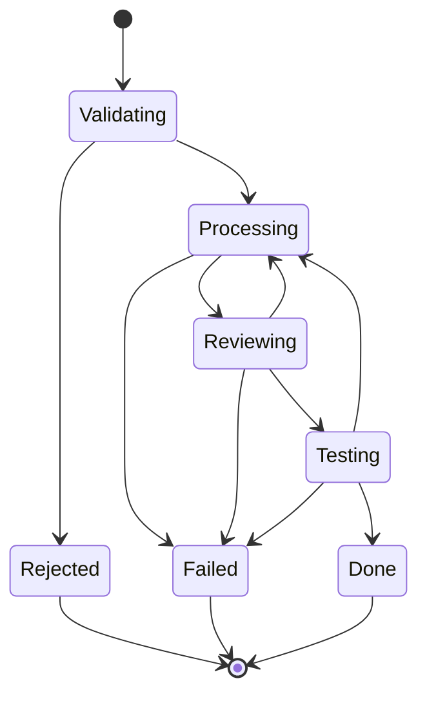
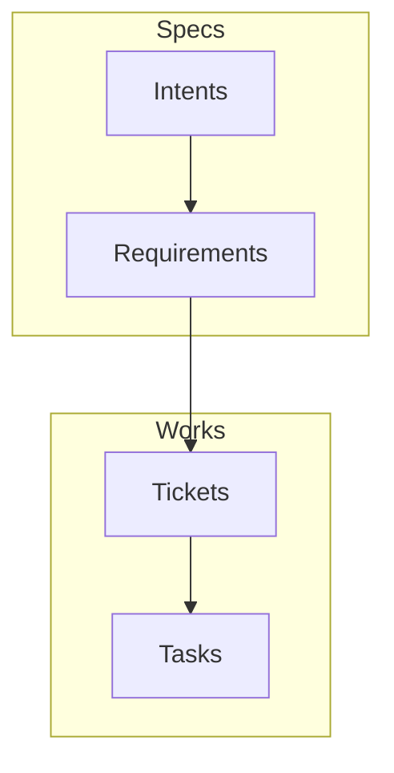

# ActionBridge

## Overview

### The Starting Point

The most reliable way to build software using AI coding agents is to request work in small, incremental steps. These steps must be executed within a highly scoped context and backed by extensive unit testing. This development workflow relies on experienced developers guiding LLMs much like they would a smart junior developer. Prompts must be highly descriptive and precise, yet completely free of irrelevant noise.

However, as codebase size and complexity grow, developer confidence plummets—even with the most rigorous unit and integration test strategies. This creates a critical paradox: the lightning-fast speed of AI code generation can induce an overwhelming, counterproductive bottleneck in human review. Pull Requests (PRs) are often validated with minimal scrutiny. In the past, developers knew exactly what was in the code, how it worked, how it was tested, and the root of its design choices. Now, AI decides and writes the code, while developers often simply push it because the tests are green.

What appears to be a productivity gain actually creates massive knowledge debt, and inevitably, technical debt.

To handle large codebases with high-level requirements in a more autonomous, AI-assisted workflow, we need a highly contextualized approach. Simply passing the root directory and broad instructions is a dead end. Larger harnesses, prompts, and memory lead to massive baseline context injections that only frontier models can handle. Any regression in model capability breaks the workflow's results. With such an approach, using local or smaller models is impossible. It forces teams to reduce the scope of expected changes and conduct deeper code reviews.

We believe there is a large space of possible optimizations that can make large-scale software development using local AI the standard of the future. ActionBridge is a fresh, logical, and rational step to materialize this necessary evolution.

### Building Better Context

Large codebases are typically divided into multiple projects, each with a deep directory hierarchy housing the source code. An agent working in the _data access layer_ does not need the same rules or documentation as one working on the _user interface_. Conversely, while all agents handling _unit testing_ might share a common baseline of rules, they still require specific guidelines based on the exact component being tested. Even the needed tools and Model Context Protocols (MCPs) will vary from one work item to another.

The core concept of **ActionBridge** is to store work-item definitions, tooling, and contextual information—such as rules, guidelines, skills, and requirements—in specific folders directly alongside the relevant source code. It introduces a structured, file-system-based workflow built as a **Hierarchical Aggregated Context Preprocessor**. This approach aggressively optimizes AI agent execution by maximizing the signal-to-noise ratio, ensuring superior results even within complex codebases. We do not provide the LLM with various options to cherry-pick in a non-deterministic, token-consuming process that pollutes the context; instead, we provide the LLM with an already refined aggregation of facts, built using a deterministic, repeatable, and controlled hierarchical aggregation process.

### From Human to Agent

The most advanced default workflow is built as a refinement process: starting from the most descriptive, human-readable artifacts to maintain a formal, coherent requirements backlog, which is then used to build deterministic, focused tasks for the final code generation. Humans need notes, wireframes, business explanations, rules, summaries, and reports. At the final stage, LLM code generation needs facts, entities, relationships, rules, and guidelines to execute explicit, unambiguous instructions. To seamlessly move from concepts to programming tasks, the advanced default workflow implements a layered refinement pipeline composed of `Intent` (global description), `Requirements` (what must be true), `Tickets` (what must be built), and `Tasks` (what must be done).

### Managing Specialized Workflows

ActionBridge does not impose a fixed, predefined workflow like Superpower or GSD does. We think that "one-process-fit-all" is a messy trap. Instead, ActionBridge serves as an engine capable of powering _any_ workflow. These workflows can be customized on a per-directory basis and operate on stateful work-items. You can use ActionBridge to implement simple workflows for trivial code sections of the project, such as basic `Tasks` work-items with limited states (`planning`, `processing`, `reviewing`, `rejected`, `failed`, `done`), or to orchestrate layered, multi-faceted workflows that use multiple work-item types in loops, regressions, and chains, in the most complicated par of the project. In other words, the same project can be powered by the simplest workflows in few locations, and the most sophisticated in others.

Because everything is file-based, workflow configurations can be self-evolving. Agents can parse summaries of past work to autonomously improve their efficiency over time by adjusting the configurations of the various implemented workflows. This enables a supervised workflow refinement process, alongside a bidirectional pipeline: requirements-to-code generation and code-to-requirements back-propagation whenever manual code editing occurs.

Because everything is file-based, interoperability with external systems or the development of new specific tooling is just a matter of reading and writing files. By localizing configurations per directory branch, there is virtually no limit to the complexity and customization of the various implemented workflows.

## The Missing Next Steps

### Why ActionBridge?

We are reaching the limits of what generic tooling and raw model scaling can achieve. The future of AI-assisted software engineering is not about asking, _"How do we endlessly enhance LLM capabilities to understand the chaos of large codebases?"_ Instead, it is about asking, _"How do we restructure software architecture to perfectly align with what LLMs are actually capable of producing?"_

We believe the future of AI-assisted software development lies in a combination of four directions:

- **Smaller LLMs**: Models specialized in planning, programming, and tool calling. They may be fine-tuned for specific languages, technical stacks, or specific aspects of development. They can run on smaller GPUs or NPUs, allowing them to operate locally alongside the developer's IDE.
    
- **Adaptive Tooling**: Using more localized, iterative, and adaptable workflows to reduce overhead and leverage smaller context windows. This is the exact purpose of ActionBridge.
    
- **Reduced Code Size**: Telling an LLM to interact with external, remote database management systems (handling queries, N+1 limits, and migrations), caches, and message brokers within a polyglot codebase full of boilerplate and noisy glue code is a massive source of hallucinations. Next-generation systems must address this inherent complexity.
    
- **Simpler Software Architectures**: Telling an LLM to navigate a large codebase composed of highly coupled components that manage concurrent processes induces a massive consumption of reasoning tokens just to evaluate implicit behaviors and anticipate side effects. Next-generation software must be extremely modular.

### Reduced Code Size

ActionBridge was born as the logical continuation of a deeper architectural technology: **Ghost Body Object (GBO)**. GBO is a groundbreaking, high-performance, transactional, persistent, and distributed .NET memory model designed primarily to radically simplify software design for _human_ developers. What works for _humans_, works for _AI_.

However, ActionBridge is entirely agnostic. It is independent of GBO technology; it neither requires nor uses it. ActionBridge can be seamlessly applied to **any** existing, structured codebase to enhance AI reliability and output quality.

Using GBO, C# objects (struct handles) _are_ the data, accessed directly in virtual memory without latency. The reality is that 99% of enterprise databases in the world fit into today's commodity server main memory. GBO eliminates the N+1 problem, the flaws of the Unit of Work pattern, and the need for serialization. It drastically reduces Garbage Collection (GC) pressure and heap allocations. Most data access operations use zero-copy patterns. Its API is ambient: there is no boilerplate code for inserting, loading, or updating—only object collection manipulation, indexes, primitives, and queues.

Furthermore, it eliminates the need for integration tests regarding persistent data and state management—all regular data access code can simply be unit tested. It introduces a new Entity Component System (ECS) object model, enabling dynamic composition and expandability at runtime. It supports LINQ without restriction for C# code calls. It is incredibly fast and transparently distributed over large server farms, eliminating the need for cache management and message brokers.

The code size reduction ratio is expected to be between 2x and 5x for an average Line of Business (LOB) solution.

> NOTE : The **Ghost Body Object** (GBO) technology isn't just a prototype - it's the result of 15 years of relentless trial, testing, and refinement. It powers a mission-critical healthcare system across 450 production instances since 2022. It is used for a complex event-sourced LOB application since 2023. The upcoming published release is the fifth major iteration, extracting battle-tested principles into a generalized, high-performance infrastructure for the .NET ecosystem.

### Software "Cell" Architecture

The next generation of software architecture must be explicitly designed for AI-assisted development. Boilerplate and glue code must be abstracted away, allowing both humans and AI to focus entirely on specific business domains and distinct functional aspects, using drastically simplified and reduced source code. GBO fulfills half of this requirement.

The second part concerns global software architectural patterns. GBO comes with a specific reference architecture based on globalized CQRS, simplified Event Sourcing, and Mutation Sourcing as a replayable CRUD model. Large projects are built using vertical modularization (e.g., `Sales`, `Users`, `Orders`, `Shipping`) intersecting with horizontal layers (`UI Components`, `UI State`, `Domain`, and `Asynchronous Services`). The front-end uses `Blazor Server Side` for direct, zero-copy, zero-serialization entity access and dynamic UI composition.

The intersection of a vertical slice and a horizontal layer forms a **Cell**. Because Cells can encapsulate other Cells, the architecture is inherently fractal. Source code is distributed across separate projects, and within each project, every aspect is organized into deep directory trees.

> **NOTE:** Vertical alignment is not an absolute architectural requirement. Overlapping and intentional misalignment are sometimes necessary mitigations. The "Cell" is more of a guiding conceptual model than a rigid technical constraint.

Crucially, each Cell completely hides its internal data structures, processes, and logic, exposing only a strict, reduced set of abstractions. This reference "Clean" architecture implements well-known patterns:

- **Commands** (what the Cell can do) and **Read Models** (what data it exposes).
    
- **States** (what the UI must render) and **Actions** (what the State can process).
    
- **Jobs** (what background operations a Service can perform), **JobStatus**, and **JobResult**.
    
In such an architecture, at any given level, only the abstractions of the underlying or adjacent components are visible, while external client components remain unknown. The context materializes a space limited strictly by its dependencies, published capabilities, and artifacts. This pattern fully embraces the SOLID principles and the Domain-Driven Design (DDD) philosophy of the "bounded context."

These Cells provide the perfect boundaries for applying the ActionBridge concept. The specifications (guidelines, rules, skills) and the development workflow are localized to each Cell, directly within the deliverable (the source code). Using the GBO ambient API, modularization is not just a design convention; it is a technical reality. The extreme simplification achieved by GBO, combined with a highly focused, reduced context, is tangibly measured by the vastly lower LLM token consumption required to implement any given feature.

Once again: while ActionBridge is perfectly cohesive with this new Cell-oriented architectural model, it is entirely agnostic. Its localized specification approach can be implemented in **any** legacy or modern project today to enhance the predictability and robustness of AI-generated code.

---

# Quick Start

### 1. Plug-In

You have to install the `BridgeMarker` plug-in :
- VS-Code : ...
- Visual Studio : ...
- Raider : ...

### 2. Start Dashboard

Download the `ActionBridge.Manager` application, an start it. Connect to the right local port with a Browser, or use the `ActionBridge.Dashboard` application.

### 3. Reference a root project directory

Click `"Add Project..."` and enter the local, absolute path to the root directory of your source code. Configure at least one LLM provider.

In the root project directory is created a `.bridge` directory.

### 4. Choose Workflow

If `ActionBridge` have never been used on this project, you have to choose a predefined Workflow Configuration. Choose the `"Basic Task Workflow"`.

### 5. First Marker

Open a source file in the project, select few code text, and call the Marker plug-ins by choosing `"Create Marker"` in local contextual `"right click"` menu. Come back in the Dashboard. You can see the Marker. You can create multiple markers.

### 6. Start a Task

Check a Marker. You can create a simple `Task`, enter a prompt then click `"Run"`. The `Task` prompt is then pushed to a fresh new Chat instance.

---

# Behind The Scene

#### You can stop here and use the Dashboard to configure the various workflows, navigate the directories, create work-items, run it, track the work in progress, use chats, view history, and iterate on your code-base. In the this section, we will explore how the system really work, behind the scene.

## Two Aspects

A `Task` is a work-item type defined in the workflow configuration. When you create a `Task` to be executed by a LLM, there is two distincts concepts :

- The **Hierarchical Aggregated Context Preprocessor** : it is the initial prompt building principle used to enhance the user prompt with additional contextual informations. This aggregation of context information is driven by a main template, a `.md` file in a dedicated directory.
  
- The **Item State Templates** : a `Task` is processed by serie of distincts Chats sessions. It can be first validated, then executed, reviewed, tested, declared failed or done. For each step execution, specific instructions are provided. This instructions are surrounding the initial prompt to manage the process. This state specific instructions are defined in `Tasks` per state templates.

### 1. Hierarchical Aggregated Context Preprocessor

When the user create a new `Task` work-item, a file is created. Example : `0100_01_paypal_support.md`

This file contains only what the user entered as a prompt. Example : `"Implement Paypal as additionnal payment service."`

This prompt will be merged in the `Task` work-item main template. Aggregated contextual informations are added to the final, Chat injected prompt. The `Task` work-item main template can be defined in the root `.bridge` directory of the project as `.bridge/Templates/task.md`. But a new `task.md` template file can be added in sub directories : one for the directory containing UI source code, one for the Data access directory, another one for Services directory. When we create a work-item from a source file located in this directories, the specific instructions will be automatically added by scanning local to root `task.md` template files, to the specific work item prompt.

This is the first step prompt aggregation, called `proprocessing`. This permit to build a riche, detailed prompt with local technical or business details.

When the user click "Run", this processed prompt is merged with the first state template.

### 2. Item State Template

Work-items are following a precise, state based workflow. For example, a `Task` work-item workflow can have this states : `validating`, `processing`, `reviewing`, `testing`, `rejected`, `failed`, `done`. A table describe the allowed transitions. Here, there is possible regressions :
- after `validating`, it can goes to  `processing` or `rejected`,
- after `processing`, it can goes to  `reviewing` or `failed`,
- after `reviewing`, he can goes to `testing` or come bask to `processing`,
- after `testing`, he can goes to `done` or come bask to `processing`.



For each state mutation in the workflow, a new file is created in which the LLM write the next step instructions. When a mutation occur, a new file is created on disk with `".wip.md"` extention, and fresh new Chat is started.

Here the files created for a complete work-Item processing :
- `0100_01_paypal_support.md` : the initial user prompt, alone.
- `0100_02_paypal_support.validating.md` : contains the initial user prompt with all the aggregated informations necessary to perform the related task (the `task.md` main template merged), surrounded with the state validating specific instructions ("you are a task validator", "validate the intent", "then create the next state").
- `0100_02_paypal_support.validating.wip.md` : contains the tools calls and logged information (optional) during the validation execution step.
- `0100_03_paypal_support.processing.md`: contains the initial user prompt again, surrounded with the processing state specific instructions ("you are a senior developer ", "execute the instruction", "then create the next reviewing state").
- `0100_03_paypal_support.processing.wip.md` : tool calls, logs.
- `0100_04_paypal_support.reviewing.md` : same logic.
- `0100_04_paypal_support.reviewing.wip.md` : tool calls, logs.
- `0100_05_paypal_support.testing.md` : initial merged prompt, instructions.
- `0100_05_paypal_support.testing.wip.md` : tool calls, logs.
- `0100_06_paypal_support.done.md` : contains an analysis of what have been done, changed and fixed.

Each `Task` work-item have a unique identifier and a state transition identifier :

`{task id}_{mutation id}_paypal_support.done.md`.

Mutation identifiers are limited to 99. Reach 98, task is automatically mutated in `failed` state and abandonned.

## Templating

### Hierarchical Aggregated

Here is an example of a directory hierarchy :

```
📁 ERP
├── 📁 .bridge
│   ├── 📄 _map.json
│   ├── 📁 .templates
│   │   ├── 📄 task.md
│   │   ├── 📄 task.validating.md
│   │   ├── 📄 task.processing.md
│   │   ├── 📄 task.reviewing.md
│   │   ├── 📄 task.testing.md
│   │   ├── 📄 task.rejected.md
│   │   ├── 📄 task.failed.md
│   │   └── 📄 task.done.md
	├── 📁 Model
    │   └── 📁 Domain
    │       └── 📄 entity_rules.md
│   └── 📁 .works
│       └── 📁 Tasks
│           ├── 📄 0100_01_paypal_support.md
│           ├── 📄 0100_02_paypal_support.validating.md
│           └── 📄 ...
└── 📁 Module.Sales.Domain
    └── 📁 Model
        ├── 📁 .bridge
        │   └── 📁 .templates
        │   │   ├── 📄 task.md
        │   │   └── 📄 task.processing.md
        │   📁 Model
        │   └── 📁 Domain
        │       └── 📄 business_rules.md
        └── 📁 Quote
            └── 📄 QuoteEntity.cs
```

When creating a `Task` from the file `QuoteEntity.cs` using a `Marker` created with the `BridgeMarker` IDE plug-in, two `.bridge` directories are visible:
- `ERP/.bridge` : the root directory, with the default templates for the `Task` work-item type.
- `ERP/Module.Sales.Domain/Model/.bridge` : a specific `.bridge` directory to contextualize the prompts. This directory contains specific, local `task.md` template and a specific `task.processing.md` template file.

Here is the `ERP/.bridge/.templates/task.md`:

```
// Top Template Content

$<prompt>
```

**Note** : `$<prompt>` instruction is a preprocessor variable insertion macro.

Here is the `ERP/Module.Sales.Domain/Model/.bridge/.templates/task.md`:

```
# DOMAIN MODEL RULES

$AGGREGATE TOP-DOWN .bridge/Model/Domain/*_rules.md

# TASK GOAL

$<prompt>
```

**Note** : `$AGGREGATE` instruction is a preprocessor macro command.

For the prompt :

```
Implementing the support for Empty status. 
The main file is "ERP/Module.Sales.Domain/Model/Quote/QuoteEntity.cs".
The enumeration file is "ERP/Module.Sales.Domain/Model/Constants/QuoteStatus.cs".
```

The initial, merged prompt from the `QuoteEntity.cs` file, will contains this:

```
// Top Template Content

# DOMAIN MODEL RULES

📄 content of  `ERP/.bridge/Model/entity_rules.md`

📄 content of  `ERP/.bridge/Module.Sales.Domain/Model/Model/business_rules.md`

# TASK GOAL

Implementing the support for Empty status.
The main file is "ERP/Module.Sales.Domain/Model/Quote/QuoteEntity.cs".
The enumeration file is "ERP/Module.Sales.Domain/Model/Constants/QuoteStatus.cs".
```

The top  `ERP/.bridge/.templates/task.md` is surrounding the lower `ERP/Module.Sales.Domain/Model/.bridge/.templates/task.md` content one. In the top file the variable `$<prompt>` is replaced by the merged lower one, where in the lower one `$<prompt>` is replaced by the user prompt. This is a Top-Down nested merging process, like a component that contains other nested components. This merged prompt will be stored in the variable `$<initial_prompt>`.

### Mutations

As example, here the `ERP/.bridge/.templates/task.processing.md` template:

```
$USE-TOOL bridge_state
$USE-TOOL file_read
$USE-TOOL file_write
$USE-TOOL file_change_list
$USE-TOOL shell
$USE-TOOL dotnet

# ROLE

You are an expert Developer.

$<initial_prompt>

$<hand_off>

# FINAL STEP

- If you finished the task, use the `bridge_state` tool to transition to `reviewing`. Specify the code sections to review.
- If you failed to complete the task, use the `bridge_state` tool to transition to `failed`. Specify why you failed to complete the task.
```

Here the `ERP/Module.Sales.Domain/Model/.bridge/.templates/task.processing.md` template:

```
$USE-TOOL search

$IF-ANY .bridge/Model/Domain/*_guidelines.md
# MODEL CODE GUIDELINES

$AGGREGATE TOP-DOWN .bridge/Model/Domain/*_guidelines.md
$END-IF

$<hand_off>
```

**Note** : here, two standard variables are used :
- `initial_prompt` : it is he merged initial prompt.
- `hand_off` : it is the message given to the `bridge_state` as hand-of-prompt, the message to give to the next Chat to know what to do.

For the prompt :

```
# INSTRUCTIONS

Goal is validated. Perform the implementation.
```

Here the result :

```
# ROLE

You are an expert Developer.

// Top Template Content

# DOMAIN MODEL RULES

📄 content of  `ERP/.bridge/Model/entity_rules.md`

📄 content of  `ERP/.bridge/Module.Sales.Domain/Model/Model/business_rules.md`

# TASK GOAL

Implementing the support for Empty status.
The main file is "ERP/Module.Sales.Domain/Model/Quote/QuoteEntity.cs".
The enumeration file is "ERP/Module.Sales.Domain/Model/Constants/QuoteStatus.cs".

# INSTRUCTIONS

Goal is validated. Perform the implementation.

# FINAL STEP

- If you finished the task, use the `bridge_state` tool to transition to `reviewing`. Specify the code sections to review.
- If you failed to complete the task, use the `bridge_state` tool to transition to `failed`. Specify why you failed to complete the task.
```

**Note** : this is the prompt as text. The tool defined with `$USE-TOOL` are not anymore visible, but are used to define the declared tools to the Chat. Just as `$<prompt>` is used to nest `task.md` templates, `$<hand_off>` acts as the nesting insertion point for state templates.

# Configuration

## The Minimal Workflow Configuration

The default configuration is a minimalist workflow that execute `Tasks`. To do so, `Spaces` must be defined.

A `Space` is a sub directory in the `.bridge` directory. Those `Spaces` are defined in `.bridge/_map.json`. This file contains directories definitions :

| Space     | Directory    | EntitiesFileConfig     | Lifecycle   | Description              |
| --------- | ------------ | ---------------------- | ----------- | ------------------------ |
| Works     | `.works`     | `_workflow.items.json` | `TRANSIENT` | Work-items management.   |
| Templates | `.templates` |                        | `FIXED`     | Prompt template library. |

This configuration define two directories. There will be the given directories in the .bridge directory :

- `.bridge/.works/` that contains tasks to execute.
- `.bridge/.templates/` that contains prompt template definitions.

Each `Space` item inherit from a `Lifecycle` reference. This values are predefined constants :

- `TRANSIENT` mean that the content of this space is only **transitory** and can be deleted when needed.
- `FIXED` mean that the content of this space is a **specification** or **configuration** and cannot be deleted.

A specific `.bridge/.works/_workflow.items.json` is created. This file define `Items`, the usage and behaviors attached to the `.md` files that populate this directory.

| Name | Directory      | Format     | Template | State        | Transitions                   | Signal   |
| ---- | -------------- | ---------- | -------- | ------------ | ----------------------------- | -------- |
| Task | `.works/Tasks` | `WORKITEM` | `task`   |              |                               | `DRAFT`  |
|      |                |            |          | `validating` | `processing` `rejected`       | `WIP`    |
|      |                |            |          | `processing` | `reviewing` `failled`         | `WIP`    |
|      |                |            |          | `reviewing`  | `processing` `failled`        | `WIP`    |
|      |                |            |          | `testing`    | `validating` `failled` `done` | `WIP`    |
|      |                |            |          | `rejected`   |                               | `CLOSED` |
|      |                |            |          | `failled`    |                               | `CLOSED` |
|      |                |            |          | `done`       |                               | `CLOSED` |

This table define the `Task` work-item. They are stored in the `.works/Tasks` in the `.bridge` directory. The file name format pattern is `WORKITEM`. It induce that ab identifier of the task and state number is attributed to each `Task` file.

Each state file can have a Signal property that signal to the Dashboard what to do with this file and how to present each to the user. This property ca have few values :
- `DRAFT` : it is simply a neutral, pending file.
- `WIP` : it mean this file must be pushed to a new Chat session and a `.wip.md` processing file created. At the end, when the Chat quit, the `.wip.md` is terminated with en `end` signal string.
- `CLOSED` : it is an end state.

# Preprocessor
## Conventions

Macros are instruction all time prefixed with a dollar `$` char. A double dollar at the start of a line is a comment.

```
$$ This is a comment line
```

Templating support variables. To insert any variable, use `$<name>` where name is the `name` of the variable.

Default variables :

- `$<root_path>`
- `$<current_file>`
- `$<prompt>`
- `$<initial_prompt>`
- `$<hand_off>`
- `$<root_file>`

## Macros

### Macro : `$IGNORE_PARENTS

### Macro : `$DEFINE <name> <value>`

### Macro : `$ADD <list name> <added value>`

### Macro : `$AGGREGATE [TOP-DOWN / BOTTOM-UP] <file filter>`

### Macro : `$INCLUDE <file path>`

### Macro : `$IGNORE <file filter>`

### Macro : `$USE_TOOL <tool name>`

### Macro : `$IGNORE_TOOL <tool name>`

### Macro : `$IF <name> $ELSE $END_IF`

### Macro : `$IF_ANY <file filter> $ELSE $END_IF`

# Advanced Workflow

## Spec-Driven Development

ActionBridge is shipped with a complete, high-quality, localized specification based workflow. It implement an iterative, emergent process. Developers can utilize it in two primary ways:

- **Coding Assistant:** Processing transient work items using explicit programming delegation, similar to traditional AI coding tools.
    
- **Specification-Driven Development:** The developer focuses entirely on editing specifications. While treating source code as a purely disposable artifact is a radical, long-term directional goal, practically, this approach allows the specifications to act as the ultimate source of architectural and business truth. The LLM acts as the execution engine that handles syntactic implementation, making the source code a highly malleable output that effortlessly adapts as the specifications evolve.
    
### The Three Spaces

ActionBridge minimizes bureaucratic overhead by strictly separating persistent architectural truth from disposable execution steps. The default configuration establishes three distinct spaces:

- **The Specification Space (Persistent):** This is the authoritative core of the system. It contains the overarching **Intents** (large-scale descriptions of what must be built) and the **Requirements**. A Requirement is highly flexible; it can dictate extremely precise technical details or outline broad business rules. Ultimately, a Requirement is simply a _“thing that must be true.”_ This space acts as the project's recipe, holding the ingredients (guidelines, rules, knowledge) and the permanent goals.
    
- **The Workflow Space (Transient):** This space handles execution without cluttering the project's long-term memory. It contains ephemeral work items: **Tickets** and **Tasks**. Tickets reference specific Requirements and are broken down into granular Tasks (the actual programming instructions). Because they are purely transient, once a Task is completed, these items can and should be deleted, ensuring developer velocity remains high.
    
- **The Deliverable Space (Output):** Contains the tangible results that must exist independently of the workflow, such as the actual source code, testing suites, or public documentation.
    
### The Generation Chain

This system naturally forms a clear, cascading generation chain: `Intents` -> `Requirements` -> `Tickets` -> `Tasks`.



Crucially, ActionBridge allows the developer to enter this chain at any level of abstraction, delegating the remaining downward steps to the AI agents. You can scale the AI's autonomy based on your immediate needs:

- **Manual Execution:** The developer creates `Tasks` directly to execute specific programming instructions, maintaining granular control over the immediate code generation.
    
- **Delegated Planning:** The developer creates `Tickets`, allowing a Chat session to plan the work and automatically break it down into actionable `Tasks`.
    
- **Automated Workflow:** The developer defines the `Requirements`. They are processed to create the necessary `Tickets`, which subsequently generate the execution `Tasks`.
    
- **Full Orchestration:** The developer focuses solely on high-level `Intents`. They are processed to align and generate the `Requirements`, cascade them into `Tickets`, and finally execute the `Tasks`.
    
Regardless of where the developer chooses to intervene, generating the final deliverable relies on the same core principle: observing what currently exists in the **Deliverable Space**, checking it against the **Specification Space**, and spinning up a transient workflow to make the code perfectly reflect the things that must be true.

### Logical Ordering

You can instruct ActionBridge to process a single item, a series of items, or all items. `Requirements` are processed in a specific order (they are sorted). Each one is assigned a unique number at the project level. Just like `Requirements`, `Tickets` and `Tasks` are also assigned unique numbers upon creation.

`Requirements` form a persistent, logical series that can be executed one by one to generate `Tickets`, and subsequently `Tasks`, to perform the actual programming work. Developers can insert new `Requirements` anywhere in the chain. However, the complete `Requirement` chain must remain logically coherent. For instance, a `Requirement` instructing the system to build a user management module must be positioned before a `Requirement` that adds a specific rule for user accounts.

### A "Distance Reduction" Engine

When processing an `Intent`, the Chat is instructed to verify whether the existing `Requirements` align with the `Intent`'s content. If a `Requirement` is not cohesive with the `Intent`, it is corrected. Furthermore, a new `Requirement` can be generated if a specific aspect of an `Intent` is not yet represented.

When processing a `Requirement`, the Chat reads the source code to evaluate whether the requirement is currently met. If the source code does not align with the `Requirement`, `Tickets` are generated to describe the necessary changes.

A `Ticket` acts as a dynamic state evaluation request. During the processing of a `Ticket`, the LLM compares the `Ticket`'s content with what actually exists in the files (the source code reality). The goal of a `Ticket` is simply to emit a sequence of `Tasks` required to reduce the distance between the ticket's intent and the current reality to zero. The LLM can achieve this in multiple steps—it does not have to emit the complete, exact list of `Tasks` all at once. For example, it can emit 3 `Tasks`, re-evaluate the state, emit 2 more `Tasks`, evaluate again, emit 1 final `Task`, and then validate the `Ticket` as complete.

- **Example:** You have a `Ticket` titled "Add PayPal support to Checkout." If you run this on a fresh branch, the AI sees a large gap between intent and reality, emitting 4 tasks to create files, write logic, and map models. If you change the `Requirements` a month later after the API structure has changed, the AI evaluates the _current_ reality, sees a smaller gap, and emits a new `Ticket`, followed by 2 `Tasks` to update the specific API mappings.
    
- **Benefits:**
    
    - **Idempotent Execution:** You can safely rerun `Requirements` or `Tickets`. If the code already matches the intents, the AI will evaluate the state and do nothing.
        
    - **Automated Refactoring:** Reactivating old `Requirements` against a newly updated foundational architecture forces the AI to bridge the gap and automatically update the local code to match the new global standards.
        
### Workflow Summary

Here a summary of the complete workflow usages:

- **Vibe Coding**: Create work items as `Intents` in the **Specification Space**. ActionBridge will then generate, modify, or expand the `Requirements`. New `Tickets` and `Tasks` may be generated and processed.
    
- **Requirement-Driven Coding**: Create a logical, ordered chain of `Requirements`. ActionBridge will verify that the chain is coherent. If valid, it generates the necessary `Tickets` for `Requirements` that are not "true" in the **Deliverable Space** (the source code).
    
- **Ticket-Driven Coding**: Create a `Ticket`. If the Ticket goals or specifications are not reflected in the **Deliverable Space** (the source code), `Tasks` are created, containing exactly instructions to reduce the distance between the code reality and the intent of the `Ticket`.
    
- **Execute Tasks**: Create a `Task` to be executed immediately.
    
As a developer, you can mix and match all four of these approaches within this ActionBridge configuration.

![[Pasted image 20260424000107.png]]
### Bidirectional State Reconciliation

You can introduce a bidirectional state reconciliation workflow. While the standard flow cascades down from **Specifications** to **Deliverables**, the system can also run in reverse to verify that actual code behaviors and implemented rules remain perfectly reflected in the `Requirements`.

If a developer introduces a manual change directly into the business logic, you can triggers a back-propagation of the source code reality into the **Specification Space**. When executed, this back-propagation ensures the `Requirements` remain the genuine, ultimate source of truth by forcing them to adapt to the actual, compiling source code.

This reverse-sync unlocks powerful workflows. Developers can manually write or insert large portions of legacy code and instruct ActionBridge to automatically generate the underlying `Requirements`. A developer can use ActionBridge to create .bridge directory at various place in the source code, to extract `Requirements` from an existing code base. Furthermore, this enables a continuous "round-trip" delta reduction loop: a developer can quickly draft poorly optimized code, use back-propagation to extract its logical intent into a `Requirement`, and then trigger a forward pass, instructing the AI to perfectly refactor and rewrite the code based on that newly minted specification using the defined programming rules, style and design guidelines.
